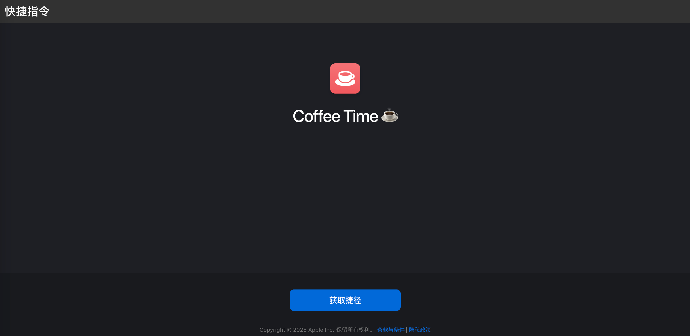

# woo-shortcuts
快捷指令合集

| 快捷指令名称      | 简介                                                                                                    | 适用场景                       |
|-------------------|---------------------------------------------------------------------------------------------------------|--------------------------------|
| [Coffee Time ☕️](https://www.icloud.com/shortcuts/b7e2c805a66b497eac24915ef30b1983)   | 一键开启“喝咖啡时间”模式，自动在 Chrome 新建窗口并依次打开： • [GitHub Trending](https://github.com/trending) • [V2EX](https://www.v2ex.com/) • [掘金](https://juejin.cn/) • [producthunt](https://www.producthunt.com/) • [Hacker News](https://news.ycombinator.com/)  。让你在喝咖啡时，第一时间浏览最新的技术动态、社区讨论和优质内容。 | 工作间隙、休息时快速获取新资讯 |

---

**如何获取快捷指令：**  
点击快捷指令合集表格中你感兴趣的快捷指令名称，即可跳转到 iCloud 分享页面，点击‘获取捷径’按钮即可一键导入到你的快捷指令 App。

